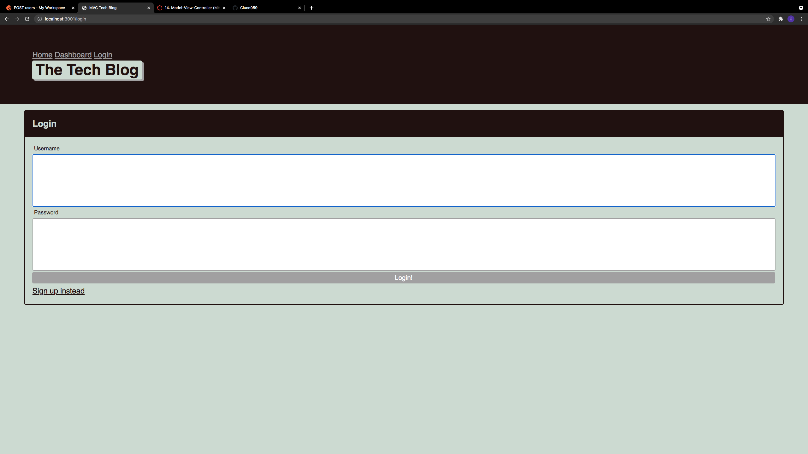

# MVC Tech Blog
  
   
  ## Description
  🔍 A CMS style blog that follows MVC structure meant for sharing tech news!
  ## Table of Contents
  - [Description](#description)
  - [Installation](#installation)
  - [Usage](#usage)
  - [License](#license)
  - [Contributing](#contributing)
  - [Tests](#tests)
  - [Questions](#questions)
  ## Installation
  💾 
  clone the project (prerequisite: node.js) 
for extra security, sent up an .en file and install dotenv to secure mysql password and session secrets.
run nom start after installing dependencies and sign up and create, edit, and comment on posts.
  ## Usage
  💻  run 'npm start' or 'node server.js'
  ## License
  
  
  This project was made without a/an  license.
  
  ## Contributing
  😇 PR's welcome
  ## Tests
  ❗ 

  ## Screenshot

  ## Questions
  👽 email me! 
   
  :octocat: Find me on GitHub: [Cluce059](https://github.com/Cluce059) 
   
  💬 Email: Cluce059@gmail.com  
  _This README was generated with ❤️ by [README-generator](https://github.com/Cluce059/readme-generator) 	👀👀👀_